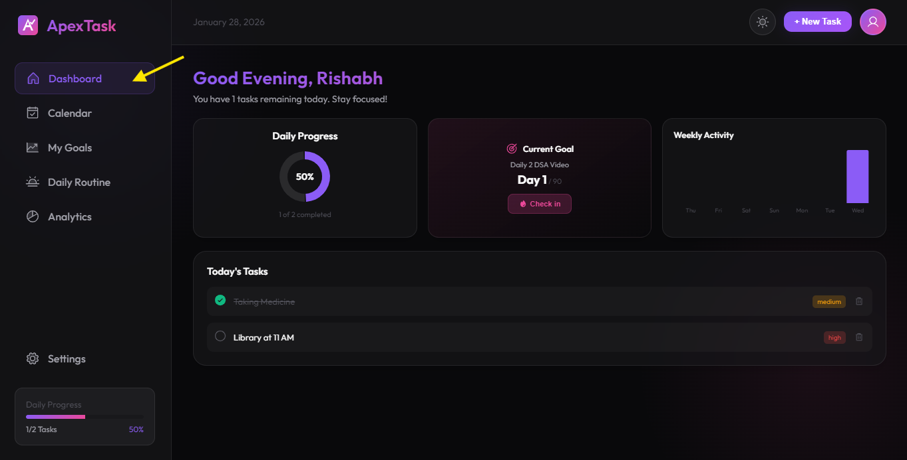
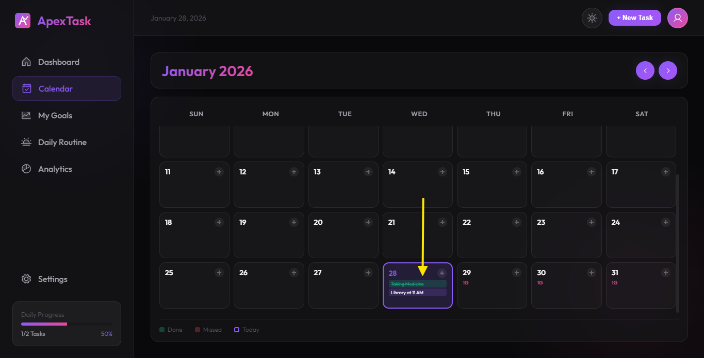
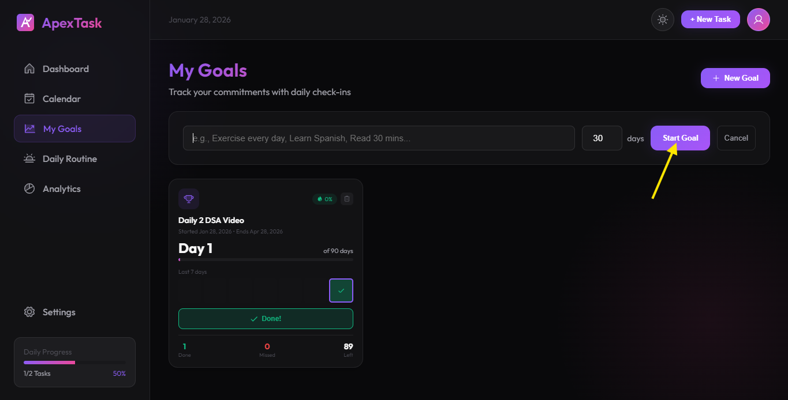
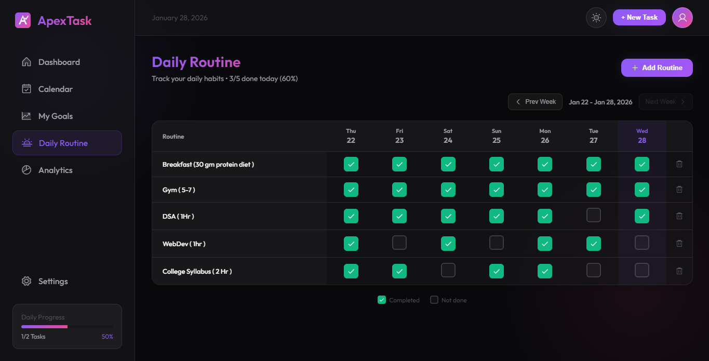
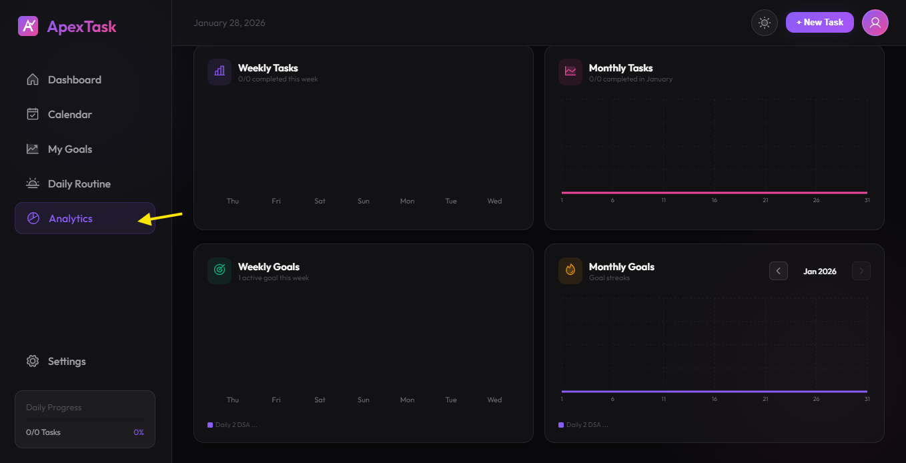
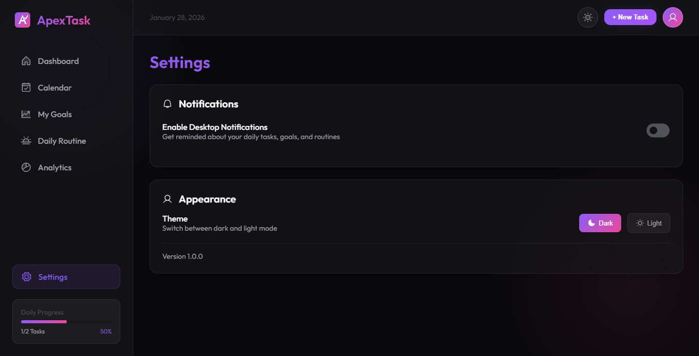

<p align="center">
  
  
  
  
</p>

<h1 align="center">⚡ ApexTask</h1>
<h3 align="center">Your Personal Productivity Companion</h3>

<p align="center">
  A beautiful, feature-rich desktop application designed to help you manage tasks, track goals, build daily routines, and analyze your productivity — all in one elegant interface.
</p>

---

## ✨ Features

### 📋 Task Management
Create, organize, and track your daily tasks with ease. Set priorities, due dates, and never miss a deadline.

### 🎯 Goal Tracking
Set long-term goals with daily check-ins. Build streaks and visualize your progress over time with detailed tracking.

### ☀️ Daily Routines
Build consistent habits with our Excel-like routine tracker. Track your morning, afternoon, and evening routines week by week.

### 📊 Analytics Dashboard
Gain insights into your productivity with beautiful charts showing weekly and monthly trends. Powered by Recharts for smooth visualizations.

### 📅 Calendar View
See all your tasks and goals in a monthly calendar. Plan ahead and stay organized with a comprehensive overview.

### 🎨 Beautiful Themes
Choose between stunning **Dark** and **Light** themes. Features modern glassmorphism design for a premium look and feel.

---

## 🖼️ Screenshots

| Dashboard | Calendar |
|-----------|----------|
|  |  |

| Goals | Daily Routine |
|-------|---------------|
|  |  |

| Analytics | Settings |
|-----------|----------|
|  |  |

---

## 🚀 Quick Start

### Prerequisites
- [Node.js](https://nodejs.org/) (v18 or higher)
- npm or yarn

### Installation

1. **Clone the repository**
   ```bash
   git clone https://github.com/CoderXRishabh/ApexTask.git
   cd ApexTask
   ```

2. **Install dependencies**
   ```bash
   npm install
   ```

3. **Run in development mode**
   ```bash
   # Web Only
   npm run dev

   # With Electron (Desktop App)
   npm run electron:dev
   ```

4. **Build for production**
   ```bash
   # Build Windows Installer
   npm run electron:build

   # Build Portable Version
   npm run electron:build:portable
   ```

---

## 📦 Tech Stack

| Technology | Purpose |
|------------|---------|
| **React 19** | UI Framework |
| **Vite 7** | Build Tool & Dev Server |
| **Electron 29** | Desktop Application |
| **Framer Motion** | Smooth Animations |
| **Recharts** | Analytics Charts |
| **React Router** | Navigation |
| **date-fns** | Date Manipulation |
| **Phosphor Icons** | Beautiful Icons |

---

## 🗂️ Project Structure

```
ApexTask/
├── electron/           # Electron main process
│   ├── main.js
│   └── preload.js
├── src/
│   ├── components/     # React components
│   │   ├── Dashboard.jsx
│   │   ├── CalendarView.jsx
│   │   ├── GoalsPage.jsx
│   │   ├── RoutinePage.jsx
│   │   ├── AnalyticsPage.jsx
│   │   ├── SettingsPage.jsx
│   │   └── ...
│   ├── context/        # React context providers
│   ├── services/       # Business logic & storage
│   ├── styles/         # CSS stylesheets
│   ├── App.jsx
│   └── main.jsx
├── public/             # Static assets
├── build/              # Build resources & icons
└── package.json
```

---

## ⚙️ Available Scripts

| Command | Description |
|---------|-------------|
| `npm run dev` | Start Vite development server |
| `npm run build` | Build for production |
| `npm run preview` | Preview production build |
| `npm run electron:dev` | Run as desktop app in dev mode |
| `npm run electron:build` | Build Windows installer (.exe) |
| `npm run electron:build:portable` | Build portable version |
| `npm run lint` | Run ESLint |

---

## 🎨 Themes

ApexTask comes with two beautiful themes:

### 🌙 Dark Theme
Modern dark glassmorphism design that's easy on the eyes for extended use.

### ☀️ Light Theme
Clean, bright theme for daytime productivity with the same elegant glassmorphism effects.

---

## 💾 Data Storage

All your data is stored locally on your machine using browser's LocalStorage API. Your tasks, goals, routines, and settings are private and never leave your computer.

---

## 🤝 Contributing

Contributions are welcome! Feel free to:

1. Fork the repository
2. Create your feature branch (`git checkout -b feature/AmazingFeature`)
3. Commit your changes (`git commit -m 'Add some AmazingFeature'`)
4. Push to the branch (`git push origin feature/AmazingFeature`)
5. Open a Pull Request

---

## 📄 License

This project is open source and available under the [MIT License](LICENSE).

---

## 👨‍💻 Author

**Rishabh** - [@CoderXRishabh](https://github.com/CoderXRishabh)

---

<p align="center">
  Made with ❤️ for productivity enthusiasts
</p>

<p align="center">
  ⭐ Star this repo if you find it useful!
</p>
